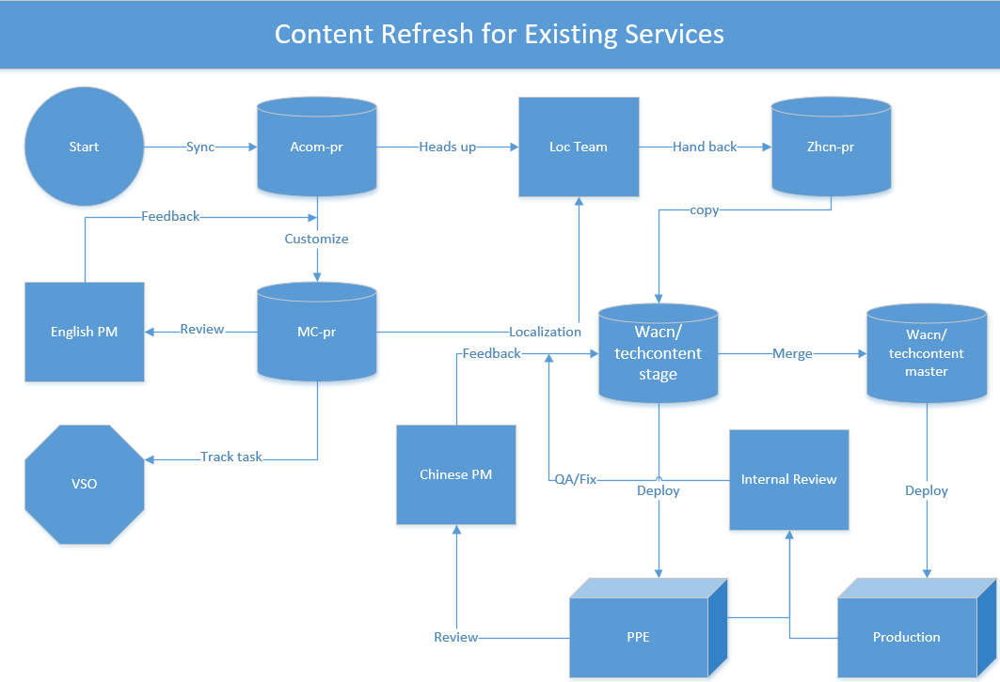
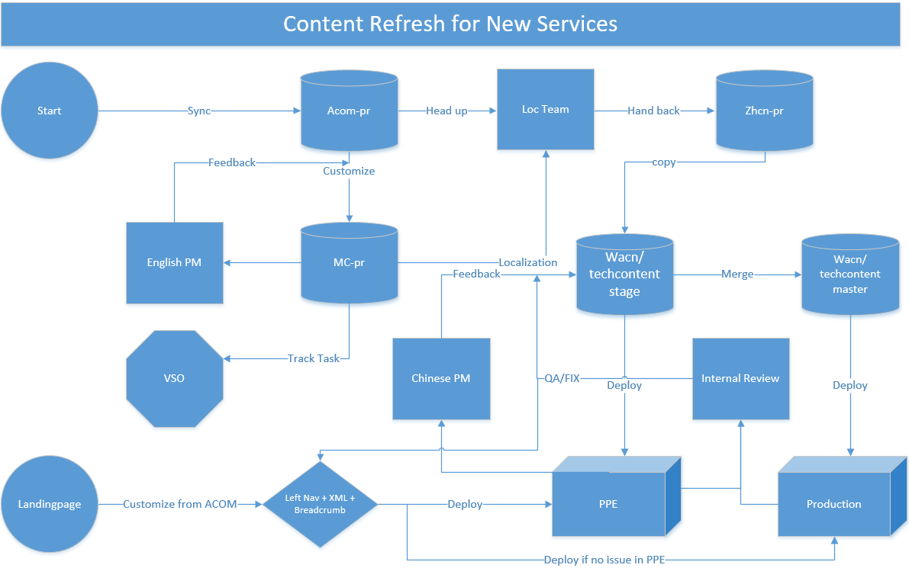
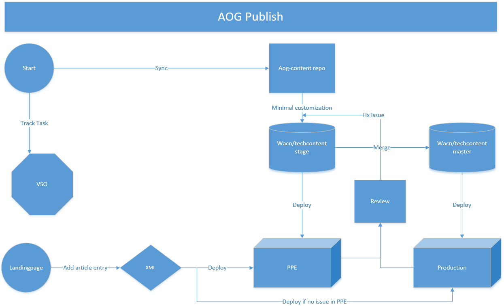
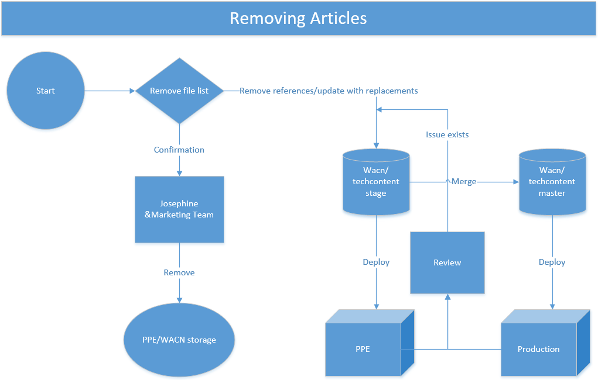

# Content Adaptation Standard and Guidance

This article introduces the workflows of Azure.cn technical content refreshing. The following diagrams show the 7 basic workflows for content team.

1. **Existing Services**

    

1. **New Services**

    

1. **Landingpage**

    

1. **Bugfix**

    

1. **Hotfix**

    

1. **AOG Publish**

    

1. **Removing Articles**

    

## Synchronizing from the global site

On the next day of the third Monday for each month, at about 11 am, Beijing time, all team members pull from [acom-pr](https://github.com/Azure/azure-content-pr/)(**Now changed to https://github.com/Microsoft/azure-docs-pr**) Repo. After the synchronization finished, compare the SHA of the master branch to make sure all team members are using the same version of acom-pr.

To get the SHA of the current HEAD, run the following git command.

    git log -1

The output is something like this.

    commit 34694600271e0a594b2a8b6cca43152eb99445b1
    Merge: 158e09e 7999bb5
    Author: PRmerger <azure-prat@microsoft.com>
    Date:   Mon Oct 17 19:20:53 2016 -0700

        Merge pull request #32300 from NarayanAnnamalai/patch-10

`34694600271e0a594b2a8b6cca43152eb99445b1` is the SHA of current HEAD.

Or, in Source Tree, open the acom-pr Repo, click Log/History, and choose the very first commit of master branch. The SHA can be seen in the commit detail panel.

### Planning Guide

After Synchronizing from acom-pr, each team member should come up with a localization plan for his services. Here is a suggested way to get the plan.

#### Getting a list of updated files and new files

1. Before Synchronizing from acom-pr, create a new branch from the master branch. Let's say "lastmonth". Merge master branch to "lastmonth" without fast-forward. For command line git client, run the following.

        git checkout lastmonth
        git merge --no-ff master

    For Source Tree, checkout to "lastmonth" by double clicking the "lastmonth" branch. Right click master branch, and choose **Merge master into current branch**.

    

    In the popup dialogue, check the option **Create a new commit even if fast-forward is possible**, and click **Ok**.

    

1. After the merge is completed, a list of modified files can be view in the merge commit.

    For command line git client, run the following.

        git log -m --name-status -1

    For Source Tree, select the merge commit in **Log/History**, and the updated files can be viewed in the commit detail panel.

    

1. If the diff tool for git has been set, use the following command to compare a file with it's previous version.

        git diff HEAD:<relative path to file> d8b0aff91b:<relative path to file>

    Notice that, `d8b0aff91b` is the SHA of "lastmonth" before merging.

    For Source Tree, just select the updated file in the commit detail panel, and then press "ctrl+D".

Compare each updated file to see if it needs to be translated again or not. Here are guidelines for updates that DO NOT need to be included.

1. Updated \<tags\> or \<properities\> (but no "pageTitle" and "description").

1. Added or deleted White spaces.

1. Modified code blocks.

#### Splitting the file list into 3-5 parts

Based on the number of working weeks between 2 synchronization days, each team member needs to split the files list from the above section into 3-5 parts, and each part will be deliver to localization team at the beginning of each working week. Here are guidelines for how to split the list.

1. Try to split the list evenly.

1. Try to put all files of a service within one part. This is better for 2 reason.

    * Only 1 review request for each service in each synchronization cycle.
    * Articles within the same service are most likely referring each other. Hence, if one article is updated while the other is not, they may conflict each other.

1. If the number of files in one service is too big to split the list evenly while having all files in one part for that service, please have the new files and include files localized first.

#### Heads-up for localization team

After the plan is prepared, send it to localization team. Even though the plan has been make, there are several things that might change it.

1. Some updates of old files are not suitable for Mooncake. they may be excluded.

1. A new service is going to be available in Mooncake. This might significantly increase the working volume for localization team.

1. A new feature in an existing service is going to be available.

## Customization

Before sending PM review request and handing over to localization team, customization of the updated files and new files is needed. Here are guidelines for customization.

### Terms replacement

#### Domain and endpoint replacement

The following is a list of Domains or endpoints that needs to be replaced in Mooncake.

* cloudapp.net -> chinacloudapp.cn

* windows.net -> chinacloudapi.cn

* azurewebsites.net -> chinacloudsites.cn

* azurehdinsight.net -> azurehdinsight.cn

* trafficmanager.net -> trafficmanager.cn

* onmicrosoft.com -> partner.onmschina.cn

* azure-mobile.net -> azure-mobile.cn

* azure.net -> chinacloudapi.cn

* vault.azure.com -> vault.chinacloudapi.cn

* cloudapp.azure.com -> chinacloudapp.cn

* management.azure.com -> management.chinacloudapi.cn

* portal.azure.com -> portal.azure.cn

* login.microsoftonline.com -> login.chinacloudapi.cn

#### Link replacement

1. Relative paths of articles should be replaced with the relative addresses on the site. For Example, "./virtual-machines-command-line-tools.md" should be replaced by "/documentation/articles/virtual-machines-command-line-tools/"

1. MSDN or technet document should be replaced by the Chinese version. For Example, "[https://msdn.microsoft.com/library/ee460799.aspx](https://msdn.microsoft.com/library/ee460799.aspx)" should be replaced by "[https://msdn.microsoft.com/zh-cn/library/ee460799.aspx](https://msdn.microsoft.com/zh-cn/library/ee460799.aspx)", and "[https://technet.microsoft.com/library/dn282285.aspx](https://technet.microsoft.com/library/dn282285.aspx)" should be replaced by "[https://technet.microsoft.com/zh-cn/library/dn282285.aspx](https://technet.microsoft.com/zh-cn/library/dn282285.aspx)".

1. Some wikipedia links can be replaced with the Chinese version. For Example, "[http://en.wikipedia.org/wiki/Adaptive_bitrate_streaming](http://en.wikipedia.org/wiki/Adaptive_bitrate_streaming)" should be replaced by "[http://zh.wikipedia.org/wiki/自适性串流](http://zh.wikipedia.org/wiki/自适性串流)"

1. Some other links which have been found in the QA section. For example, some MSDN links are redirected to Azure articles in global site. Those links should be replaced with a relative url.

#### Other terminologies

1. **Azure Region**. All Azure Region should be replaced by either "China North" or "China East".

1. **Azure portal**. The new portal should be replaced by "Azure Portal Preview", and the classic portal should be replaced with "Azure Classic Management Portal".

1. **Microsoft Azure**. "Microsoft Azure" Should be replaced by "Azure".

1. **Free trial**. "Free trial" should be replaced with "1rmb trial".

For term replacement, a tool has been developed with python. Here is the [GitHub Repo](https://github.com/rockboyfor/CustomizeTool).

### Deleting not suitable contents

For features that are not available in Mooncake, Check [this Excel file](https://microsoft.sharepoint.com/teams/devdivfs/wacntechcontent/_layouts/15/WopiFrame.aspx?sourcedoc=%7B6FF06475-2148-475F-B9C1-EFDFE3B98561%7D&file=ACOM%26WACNDiff.xlsx&action=default&IsList=1&ListId=%7B6BA72AB0-DAE3-4226-8177-679310C82C46%7D&ListItemId=33) in sharepoint.

### Some detailed customizations

For some important articles, contents may not be suitable for Mooncake. However, if a substitute solution exits, those articles still can be customized.

For Example, in App Service of Mooncake Environment. Continuous deployment is not possible to be set through the Portal. However, it can be done for public Repo in GitHub with KUDU and Webhook. Since, the continuous deployment functionality is quite important for App Service, and it's related with Agile Development which is also very important for App Service. Customizing the article other than simply deleting it would be a good idea.

However, if the features involved become available in Mooncake, those customizations will not be needed any more. That is what happened for Redis Cache. Before the new portal is available in Mooncake, Redis Cache could only be manageable with Azure PowerShell or Azure CLI. So, all portal solutions were replaced by command line solutions. After Redis Cache is available in the preview portal, all those customizations should be rolled back.

## Sending PM review

After the customizations are done, send the updated articles and new articles to PM. Here are guidelines for PM review request.

1. Use [Pandoc](http://pandoc.org/) to generate docx files from md files. And, here is the command line.

        pandoc -s -S <the md file name> -o <out put file>.docx

1. If the modification of an article is minor, don't send it to PM.

1. For new articles, highlight the customized parts. For updated articles, highlight the updated parts.

1. If the PM has found out the screenshots are not suitable for Mooncake, and insist to customized those screenshots, customized them once, and tell the PM that content team is not supposed to do image customization.

1. If the PM requires to get more details about the customizations that have been done, open "Track Changes" in the docx file, and instead of generating docx from the customized md file, edit it directly from the original version. Or, adding comments about the customizations that have been done is also a good idea.

1. Ask for feedback and sign-off within 3 days, and tell the PM that correctness will be assumed if no feedback received.

1. For PMs that read Chinese, instead of sending docx file, sending PPE links of the new or updated articles after they are localized and deployed to PPE is OK too.

## Content Refresh in Azure.cn

After the articles are delivered to localization team, it will take about 1 week for them to translate those articles. The localized articles will be hand back through [zhcn-pr Repo](https://github.com/Azure/azure-content-zhcn-pr/). And then, the content refresh cycle of [techcontent Repo](https://github.com/wacn/techcontent/) can be started.

###  QA in PPE

Before Deploying to Production, updated contents should be reviewed in PPE.

1. Copy the updated files and new files from zhcn-pr Repo to the stage branch of techcontent Repo.

1. Update the wacn.date of the new or updated files to be the date the localized articles are handed back.

1. Commit and push the updates, and deploy to PPE.

1. QA in PPE. A broken link checking tool has been developed. Here is the [GitHub Repo](https://github.com/rockboyfor/MoonScanner/). If any issue, fix it and go back to step 3.

1. If no issue any more, merge the changes to master branch by doing a merge commit or by doing cherry-pick.

### QA in Production

After the QA in PPE is done, updates should be deployed to Production.

1. Push the changes of master branch to remote. and deploy to Production.

1. QA in Production. The same broken link checking tool can be used here too. If any issue, fix it in the stage branch, and go back to step 3 of section [QA in PPE](#qa-in-ppe).

1. repeat until there is no more issue.

##  Articles for a new service

The workflow for new services is almost identical to the one for existing services, except that a new landing page for the new service needs to be generated, and the articles of the new service may not be in the heads-up for the localization team.

There is a landing page functionality in [the team portal](http://acncontentteam.azurewebsites.net/landingpage/new/). Follow the steps to create a new landing page.

1. Open the Chinese landing page in the global site. Let's take Virtual Network as an example.

    

    There are 6 things useful for the new landing page.

    * the left navigation (the whole html code of the navigation is needed)
    * the service name ("虚拟网络")
    * the url ("[https://azure.microsoft.com/zh-cn/documentation/services/virtual-network/](https://azure.microsoft.com/zh-cn/documentation/services/virtual-network/)")
    * the subtitle ("Learn how to configure and monitor virtual networks in Azure")
    * the tutorial message (empty here)
    * the tutorial list ("[Create a Virtual Network](https://azure.microsoft.com/zh-cn/documentation/articles/virtual-networks-create-vnet-arm-pportal/)")

1. Right click the left navigation and choose "Inspect Element". Copy the whole html code of the \<ul\> tag. the html looks like the following.

        <ul>
         <li>
          <a data-event="articles-clicked-category" href="#" class="toggler open" ms.pgarea="content" ms.cmpgrp="body" ms.cmptyp="link" ms.cmpnm="概述" ms.title="" ms.interactiontype="1">概述</a>
           <ul class="toggled open">
            <li>
             <a data-event="articles-clicked-link" href="/zh-cn/documentation/articles/virtual-networks-overview/" ms.pgarea="content" ms.cmpgrp="body" ms.cmptyp="link" ms.cmpnm="虚拟网络 (VNet)" ms.title="" ms.interactiontype="1">虚拟网络 (VNet)</a>
            </li>
        ...

1. In the [the team portal](http://acncontentteam.azurewebsites.net/landingpage/new/), enter the corresponding values.

    

1. Click **OK**, and then, a new Landing page will be generated.

    

1. This is a blank landing page. Click "编辑" to enter the edit mode of the landing page.

    

    Contents can be edited by clicking the "pen". List items in the left navigation can be moved around, added, or deleted. Videos and service updates can be added or deleted.

1. After the editing is finished, click "保存" to save the page. And then, the landing page is updated.

    

1. Click "生成导航json" to generate a json for the left navigation. Copy it and save as a json file. Please name the file as "documentation,leftnav,virtual-networks.json", and check in the file to VSO.

    For the naming strategy, "documentation,leftnav," is fixed, and "virtual-networks" is the service id, which means if an article's ms.service is "virtual-networks", the article is using this left navigation.

1. Click "生成页面xml" to generate an xml for the landing page. Copy it and save as an xml file. Please name the file as "documentation,services,virtual-networks.xml", and check in the file to VSO.

    by naming the xml to be "documentation,services,virtual-networks.xml", the landing page can be accessed from the url "/documentation/services/virtual-networks/".

1. After the json and xml files is generated, go through the QA cycle to review the new landing page. The process is the same as [above in content refresh](#qa-in-ppe), except that there is no branch in VSO for the json and xml files.

## Refreshing landing page

All landing pages should be updated in the middle of every month. The same tool ([the team portal](http://acncontentteam.azurewebsites.net/landingpage/)) as above can be used to edit the exiting landing pages. Only the left navigation, subtitle, tutorial message, and tutorial list can be updated from the global. Videos need to be updated only if new Videos are uploaded to the media center. Service update need to be updated only if "[what-is-new](https://www.azure.cn/what-is-new/)" is updated.

After the json and xml files are updated, go through the same QA cycle. For more information, see [above in content refresh](#qa-in-ppe).

## Bugfix and hotfix

Sometimes, Feedbacks or bug reports will be received from customers or other teams. First, determine if it's an issue of the technical content. If yes, create a bug in VSO for tracking, and fix it in the Repo.

Again, go through the QA cycle until there is no more issue, and then, close the bug in VSO.

## AOG articles

The authors of AOG articles may require to update exiting AOG articles or deploy new articles. The workflow is the same as **Bugfix and hotfix**, except that instead of creating bug in VSO, create a task under AD HOC.

## Removing articles

Articles in global site may be deleted, and some external or internal feedbacks may point out that some articles are not suitable for Mooncake. Those articles should be deleted in both PPE and Production. For articles deleted in global, checking for replacements is also needed. To get the replacement for a deleted article, just go to the corresponding page in global site to see if there is a redirection.

Since there might be references to the deleted articles in some other parts of Azure.cn, notification to Dev Team and Marketing Team is required.

After removing the articles from the Repo, deleting or replacing the references of them is also required, not only the md files, but also the json and xml files of landing pages.

For QA cycle, see [above in content refresh](#qa-in-ppe).

For updating landing pages, see [above in "Articles for a new service"](#articles-for-a-new-service)

Deleting the files from the Repo will not delete the corresponding pages in Azure.cn. To delete the pages, the corresponding HTML should be deleted from the storage. Deleting pages should be deleted from PPE storage right after the md files is deleted in stage branch, in case that other team members are doing QA in PPE.

Pages could be deleted from Production storage only after Dev team and Marketing team's confirmation.